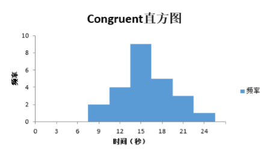
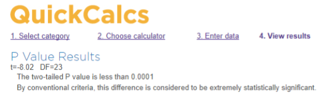

### 统计学：检验心理学现象

#### 背景信息

在一个Stroop （斯特鲁普）任务中，参与者得到了一列文字，每个文字都用一种油墨颜色展示。参与者的任务是将文字的打印颜色大声说出来。这项任务有两个条件：一致文字条件，和不一致文字条件。在一致文字条件中，显示的文字是与它们的打印颜色匹配的颜色词，如“红色”、“蓝色”。在不一致文字条件中，显示的文字是与它们的打印颜色不匹配的颜色词，如“紫色”、“橙色”。在每个情况中，我们将计量说出同等大小的列表中的墨色名称的时间。每位参与者必须全部完成并记录每种条件下使用的时间。

#### 调查问题

作为一般说明，请确保记录你在创建项目时使用或参考的任何资源。作为项目提交的一部分，你将需要报告信息来源。

##### (1) 我们的自变量是什么？因变量是什么？

自变量：文字与打印颜色是否匹配
因变量：参与测试人员的反应时间


##### (2) 此任务的适当假设集是什么？你需要以文字和数学符号方式对假设集中的零假设和对立假设加以说明，并对数学符号进行定义。你想执行什么类型的统计检验？为你的选择提供正当理由（比如，为何该实验满足你所选统计检验的前置条件）。

适当假设集：

通过执行Stroop （斯特鲁普）任务，假设并验证：文字与打印颜色匹配/不匹配时，对参与测试人员有影响，即文字与打印颜色不匹配会影响测试人员的反应时间。

$\mu_c$：文字与打印颜色匹配时参与测试人员的反应时间（总体均值）

$\mu_I$：文字与打印颜色不匹配时参与测试人员的反应时间（总体均值）

零假设：文字与打印颜色不匹配，可能对参与测试人员没有影响，即：$H_0：\mu_C = \mu_I$ 

对立假设：文字与打印颜色不匹配可能会增加参与测试人员的反应时间，即：$H_A：\mu_C ≠ \mu_I$

准备执行重复衡量t假设校验。

首先，通过执行Stroop （斯特鲁普）任务可知，此测试关注的是文字与打印颜色匹配/不匹配时测试人员反应时间之间的差异。因此针对文字与打印颜色匹配/不匹配这两种情况，采用同一组测试人员进行的重复衡量测试。Stroop （斯特鲁普）任务属于典型的两个相依样本重复衡量测试。

其次，分析Stroop （斯特鲁普）数据集可知，Congruent（文字与打印颜色匹配）和Incongruent（文字与打印颜色不匹配）的样本数据大致成正态分布，因此可假设总体数据满足正态分布。

综上所述，我选择执行重复衡量t假设统计检验（配对t校验）。


```
现在轮到你自行尝试 Stroop 任务了。前往此链接，其中包含一个基于 Java 的小程序，专门用于执行 Stroop 任务。记录你收到的任务时间（你无需将时间提交到网站）。现在下载此数据集，其中包含一些任务参与者的结果。数据集的每行包含一名参与者的表现，第一个数字代表他们的一致任务结果，第二个数字代表不一致任务结果。
```

##### (3) 报告关于此数据集的一些描述性统计。包含至少一个集中趋势测量和至少一个变异测量。

通过分析数据集，可知：

1. Congruent（文字与打印颜色匹配）与Incongruent（文字与打印颜色不匹配）的样本数据差异为：

    $D_1 = X_{C1} - X_{I1}，D_2 = X_{C2} - X_{I2}，……，D_n = X_{Cn} - X_{In}$

样本差异均值$\bar{D}$：

$\bar{D} = \frac{\sum_{i = 1}^{n} D_i}{n} = -7.96$

文字与打印颜色匹配/不匹配的差异值：

$\mu_C - \mu_I = 样本差异均值 = \bar{D} = -7.96$

2. 根据数据集，可知：

    样本数量：n = 24

    自由度： n-1 = 23

3. 经过计算，文字与打印颜色匹配/不匹配差异的标准偏差：

$S_D = \sqrt{\frac{\sum_{i = 1}^{n}(D_i - \bar{D})^{2}}{n - 1}} = 4.86$


##### (4) 提供显示样本数据分布的一个或两个可视化。用一两句话说明你从图中观察到的结果。

根据Congruent的样本数据，以3秒作为组距，得到以下直方图：



根据此直方图可知， Congruent的样本数据大致呈正态分布，大部分人的用时在9~18秒。

 

##### (5) 现在，执行统计测试并报告你的结果。你的置信水平和关键统计值是多少？你是否成功拒绝零假设？对试验任务得出一个结论。结果是否与你的期望一致？

根据第2题可知： 
1. 样本数量： $n = 24$ 
    文字与打印颜色匹配/不匹配的差异值：$\mu_C -\mu_I = -7.96$ 
    文字与打印颜色匹配/不匹配的差异标准偏差：$SD = 4.86$

2. t 统计量： 
   $t 统计量 =\frac{ (\mu_𝑐 − \mu_𝐼)}{\frac{𝑆𝐷}{\sqrt{n}}}= -8.02​$ 

3. a. $选择 α = 0.05、自由度n-1 = 23，则 t 临界值：$
   $t 临界值 = ±2.069$ 

   b. $选择 α = 0.05、自由度 n-1 = 23，t 统计量 = -8.02，则 p 值：$ 
   $p 值 = 0.0001$ 

   

4. a. $由于 t 统计量 = -8.03 超过了 t 临界值 = ±2.069，位于左侧临界区内。因此我们成功拒绝零假设。$ 
   b. $由于p 值 =0.0001 < α = 0.05，因此我们成功拒绝零假设。$ 

5. 试验任务的结论：执行 Stroop （斯特鲁普）任务，当文字与打印颜色匹配/不匹配时，对参与测试人员有影响，即文字与打印颜色不匹配会影响测试人员的反应时间。 

6. 结果与预期相符。 

